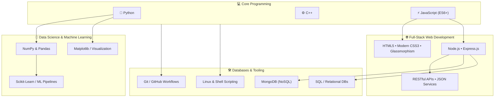
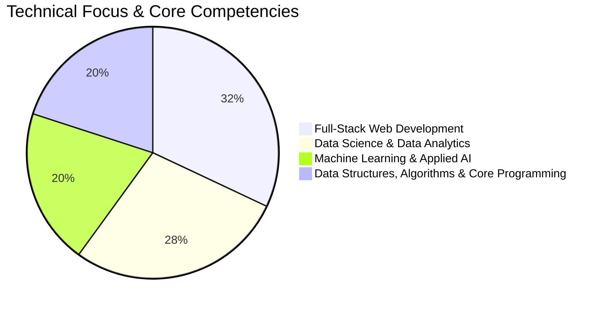

<div align="center">

# 🌌 Pruthviraj Patil — Personal Portfolio

**B.Tech CSE (Data Science) Student • Aspiring Software Engineer • Creative Problem Solver**

[](https://github.com/rajpatil25379-star/Personal-Portfolio)
[](https://developer.mozilla.org/en-US/)
[](https://github.com/rajpatil25379-star/Personal-Portfolio)
[](https://www.linkedin.com/in/pruthviraj-patil-184644380/)

<br/>

[🚀 Live Demo](https://pruthviraj-patil20.github.io/Personal-Portfolio/) • [🌟 Featured Projects](#-featured-projects) • [📜 Certifications](#-certifications--achievements) • [🛠️ Technical Skills](#️-technical-skills) • [💻 Local Setup](#-getting-started) • [📫 Connect](#-connect-with-me)

---

</div>

## 📖 About The Project

Welcome to the official repository for my developer portfolio! This project serves as an interactive digital resume and showcase of my journey in **Computer Science Engineering (Data Science)**, highlighting full-stack web applications, machine learning pipelines, verified certifications, and creative problem-solving.

Built with pure, modern web standards without external CSS/JS dependencies, it delivers agency-grade aesthetics, 60fps animations, instant loading, and complete accessibility.

---

## ✨ Key Features & Interactive Design

- 🎬 **Cinematic Welcome Experience:** Engaging letter-by-letter staggered intro sequence with ambient SFX, sound equalizer, and mute controls.
- 🌌 **Interactive Particle Engine:** Real-time canvas particle background responding dynamically with floating stellar motion.
- 💎 **Modern Glassmorphic UI:** Crafted with frosted glass effects (`backdrop-filter: blur()`), gradient border highlights, and tailored HSL color palettes.
- 📜 **4-Column Certifications Showcase:** Desktop-optimized, responsive 4-column side-by-side grid with verified credentials, issuer badges, and instant download actions.
- 🔍 **Interactive Lightbox Modal:** Full-screen zoom and preview modal for inspecting certificates and project visual assets.
- 📱 **Fluid Responsiveness:** Adaptive CSS Grid and Flexbox architecture tailored for mobile phones, tablets, and ultra-wide displays.
- ⚡ **Zero Framework Overhead:** 100% Vanilla HTML5, CSS3, and ES6+ JavaScript for blazing fast load times and clean code architecture.

---

## 🚀 Live Demo

Experience the live portfolio interactive preview:

🔗 **[https://pruthviraj-patil20.github.io/Personal-Portfolio/](https://pruthviraj-patil20.github.io/Personal-Portfolio/)**

---

## 🌟 Featured Projects

| Project | Tech Stack | Highlights | Links |
| :--- | :--- | :--- | :---: |
| **Project Panopticon** 🛡️ | Python, Pandas, Scikit-Learn, Web Dashboard | Intelligent, ethical time-series machine learning pipeline detecting academic dishonesty in remote exams while protecting honest students. | [Live Demo](https://pruthviraj-patil20.github.io/PROJECT-PANOPTICON/) • [GitHub](https://github.com/Pruthviraj-patil20/PROJECT-PANOPTICON) |
| **NASA APOD Viewer** 🛰️ | NASA APOD API, Vanilla JS, CSS3 | Displays daily astronomical imagery and astrophysics educational logs with cosmic time-travel date navigation. | [Live Demo](https://pruthviraj-patil20.github.io/-NASA-APOD-Viewer/) • [GitHub](https://github.com/Pruthviraj-patil20/-NASA-APOD-Viewer) |
| **EventSphere** 🎉 | Node.js, Express, MongoDB, Vanilla JS, Chart.js | Enterprise SaaS event discovery & ticketing platform with cryptographic QR wallet validation and real-time organizer analytics. | [Live Demo](https://pruthviraj-patil20.github.io/Event-Management-System/) • [GitHub](https://github.com/Pruthviraj-patil20/Event-Management-System) |
| **StudyFlow** ⏱️ | HTML5, CSS3, Vanilla JavaScript, LocalStorage | Productivity dashboard with drag-and-drop Kanban task boards, Pomodoro timer, calendar scheduling, and local persistence. | [Live Demo](https://pruthviraj-patil20.github.io/Study-Planner/) • [GitHub](https://github.com/Pruthviraj-patil20/Study-Planner) |
| **Movie Search App** 🎬 | ES6 Modules, TMDB API, CSS3, Vite | Movie discovery and watchlist application with live debounced search, genre filtering, YouTube trailer modal, and theme switcher. | [Live Demo](https://pruthviraj-patil20.github.io/Movie-Search-App/) • [GitHub](https://github.com/Pruthviraj-patil20/Movie-Search-App) |
| **SKYCAST** ☁️ | OpenWeatherMap API, ES6 Modules, CSS3 | Atmospheric weather platform with 5-day forecasts, geolocation detection, city bookmarks, and air quality index monitoring. | [Live Demo](https://pruthviraj-patil20.github.io/Weather-App/) • [GitHub](https://github.com/Pruthviraj-patil20/Weather-App) |

---

## 📜 Certifications & Achievements

| Credential | Issuer | ID / Type | Date |
| :--- | :--- | :--- | :--- |
| **Inclusive Open Source Community Orientation (LFC102)** 🐧 | **The Linux Foundation** | `LF-sqgvexqjk9` | August 17, 2026 |
| **Artificial Intelligence Internship – Training** 🤖 | **iSTUDIO** | `ISAFIT3323329` | August 26, 2026 |
| **Artificial Intelligence Internship** 💼 | **Internship Studio** | `ISAFII3323329` | May 23 – Aug 26, 2026 |
| **Road to GSoC: Git and GitHub Open Source Workshop** 🌐 | **Advanced Tech Club, NIAT Pune** | Participation | February 07, 2026 |

---

## 🛠️ Technical Skills & Competency Graphs

### 🗺️ Technical Architecture & Ecosystem



<br/>

### 🎯 Skill Domain Focus Distribution



<br/>

### 📊 Proficiency & Experience Matrix

| Domain | Technology / Tool | Proficiency Graph | Level |
| :--- | :--- | :--- | :--- |
| **Programming** | **Python** | `████████████████░░░░` 82% | Advanced |
| | **JavaScript (ES6+)** | `███████████████░░░░░` 78% | Proficient |
| | **C++** | `█████████████░░░░░░░` 68% | Intermediate |
| **Data Science & AI** | **Pandas & NumPy** | `████████████████░░░░` 82% | Advanced |
| | **Data Visualization (Matplotlib)** | `███████████████░░░░░` 76% | Proficient |
| | **Machine Learning (Scikit-Learn)** | `██████████████░░░░░░` 72% | Intermediate |
| **Web Development** | **HTML5 & Semantic Structure** | `██████████████████░░` 92% | Expert |
| | **Modern CSS3 / UI & Animations** | `██████████████████░░` 90% | Expert |
| | **Vanilla JavaScript & DOM Engine** | `████████████████░░░░` 82% | Advanced |
| | **Node.js & Express.js** | `██████████████░░░░░░` 72% | Intermediate |
| **Databases** | **SQL & Relational Modeling** | `███████████████░░░░░` 76% | Proficient |
| | **MongoDB & Document Stores** | `██████████████░░░░░░` 70% | Intermediate |
| **DevOps & Tools** | **Git & GitHub Version Control** | `█████████████████░░░` 86% | Advanced |
| | **Linux / Bash & CLI Tools** | `███████████████░░░░░` 75% | Proficient |
| | **VS Code & Developer Workflow** | `████████████████░░░░` 84% | Advanced |

<br/>

### 🧰 Technology Arsenal

<div align="left">

- **Languages:**   
- **Frontend:**   
- **Backend & APIs:**   
- **Data Science & AI:**   
- **Databases:**  
- **Developer Tools:**    

</div>

---

## 🎓 Education

- **B.Tech in Computer Science Engineering (Specialization in Data Science)**
  - *NxtWave Institution of Advance Technologies, Pune* | **2025 – 2029**
  - Focus areas: Programming, Algorithms, Software Engineering, Applied Machine Learning, Data Analytics.

- **Higher Secondary Education (11th & 12th — Science & Mathematics)**
  - *Vishwanath Vidyalaya, Beed, Maharashtra*
  - Strong foundational academic coursework in mathematics, physics, and computer applications.

---

## 📂 Project Structure

```text
Personal-Portfolio/
├── assets/
│   ├── certificates/
│   │   ├── Artificial_Intelligence_Internship_Certificate.pdf
│   │   ├── Artificial_Intelligence_Internship_Studio_Certificate.pdf
│   │   ├── Linux_Foundation_Certificate.pdf
│   │   ├── ai_certificate_thumbnail.jpg
│   │   ├── ai_internship_studio_thumbnail.jpg
│   │   ├── gsoc_git_github_certificate.jpg
│   │   └── linux_foundation_thumbnail.jpg
│   └── images/
│       ├── profile.jpg
│       └── ...
├── css/
│   └── style.css            # Modular design system, responsive grids & keyframe animations
├── js/
│   └── script.js            # Particle canvas engine, cinematic intro, modal lightbox & nav
├── index.html               # Semantic, SEO-optimized markup
└── README.md                # Comprehensive documentation
```

---

## 💻 Getting Started

To explore or modify this portfolio locally:

### Option 1: VS Code Live Server (Recommended)
1. Clone this repository:
   ```bash
   git clone https://github.com/rajpatil25379-star/Personal-Portfolio.git
   cd Personal-Portfolio
   ```
2. Open in VS Code:
   ```bash
   code .
   ```
3. Right-click on `index.html` and select **"Open with Live Server"**.

### Option 2: Python Built-in Server
Run from the root directory:
```bash
python3 -m http.server 8000
```
Then open `http://localhost:8000` in your browser.

### Option 3: Node / npx
```bash
npx serve .
```

---

## 📫 Connect with Me

<div align="center">

[](https://www.linkedin.com/in/pruthviraj-patil-184644380/)
[](https://github.com/rajpatil25379-star)
[](mailto:rajpatil25379@gmail.com)

**Pruthviraj Patil** • *Pune, Maharashtra, India*

---
*Designed & developed with ❤️ by Pruthviraj Patil.*

</div>
